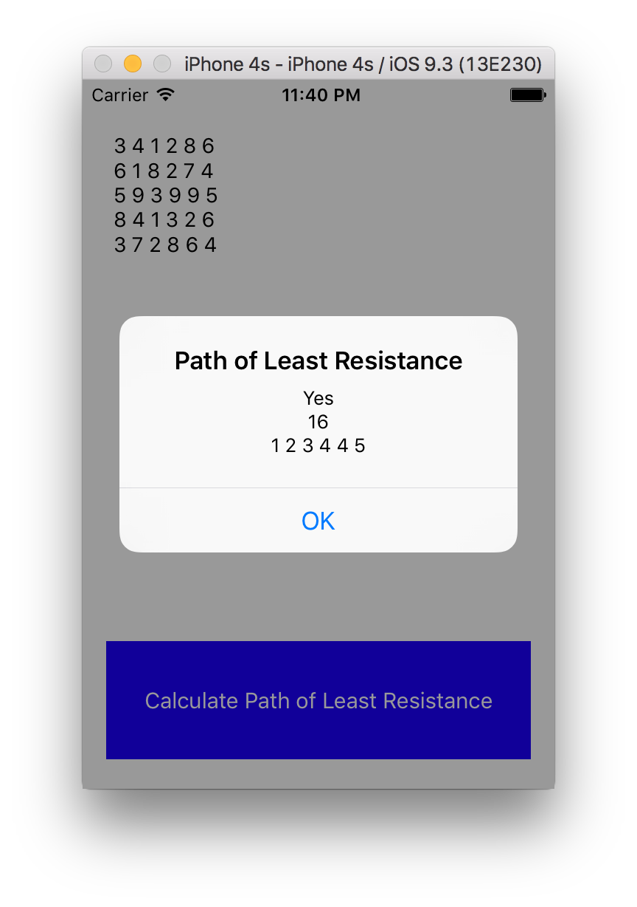

# Path of Least Resistance Code Kata

## The Challenge
Energy flows through the path of least resistance. For this challenge, you are provided a grid of integers where each integer represents the amount of resistance encountered at a given point on the grid. Energy enters the grid from the left (at any point) and passes through the grid to the right, moving only one column per round.

Movement is always to an adjacent row, meaning energy can flow horizontally or diagonally. For the sake of this challenge, we assume the first and last row are also adjacent. Effectively, the grid “wraps”.

The total resistance of a path is the sum of the integers in each of the visited cells. The solution needs to handle grids of various sizes with a minimum of 1 row and 5 columns up to 10 rows and 100 columns. If in the next move, the total resistance will exceed 50, the energy cannot continue.

The purpose of this challenge is to find the path of least resistance (that is, the path with the lowest total resistance). The paths of least resistance through two slightly different 5 x 6 grids are shown below. The grid values differ only in the bottom row. The path for the grid on the right takes advantage of the adjacency between the first and last rows.

## Input
The input consists of a sequence of row specifications. Each row is represented by a series of delimited integers on a single line. Note: integers are not restricted to being positive.

## Output
Three lines should be output for each matrix specification. The first line is either “Yes” or “No” to indicate the water made it all the way through the grid. The second line is the total resistance. The third line shows the path taken as a sequence of n delimited integers, each representing the rows traversed in turn. If there is more than one path of least resistance, only one path need be shown in the solution.

# Build & Run

## Tools
The project is written in Swift 2 and requires Xcode 7.3 or higher.

## Unit Tests
Use the Xcode test navigator to run all unit tests.

## Run/Debug in IDE
Click the Run button to execute command line app from the IDE. The app will read input from stdin. use the Xcode console to enter data for the grid. Resistance values within rows must be separated by a single space. For example

```
1 2 3
4 5 6
7 8 9
```

Enter a blank line after the last row to start the program.

## Run from Command Line
To run the app from the command line select the PathOfLeastResistance executable in the Xcode project navigator and choose "Show in Finder". Use the finder to copy the executable to the directory in which you want to run it.

The given example data is provided as files in the data directory within the project. Assuming you put the executable in directory called "bin" within the project you would run the examples like this:

```
$ cat data/Example1.txt | bin/PathOfLeastResistance
Yes
16
1 2 3 4 4 5
```
```
$ cat data/Example2.txt | bin/PathOfLeastResistance
Yes
11
1 2 1 5 4 5
```
```
$ cat data/Example3.txt | bin/PathOfLeastResistance
No
48
1 1 1
```

## Run iOS App
To run the iOS app choose the PLiOS target, choose a simulator and click the Run button.

The button to calculate the path of least resistance is disabled when the app first starts up. You have to enter grid data before you can press it.

Touch the text area and use the keyboard to enter the grid data. Only numeric digits, space, backspace and return will work on the keyboard. Pressing any other character will dismiss the keyboard.

If the grid data you've entered is invalid then the button will remain disabled. Only numbers separated by single spaces and new lines are considered valid. All rows must have the same number of items.

When you have entered valid grid data, press the button to calculate the path of least resistance.




The iOS app has been tested on iOS 9.3.1.
